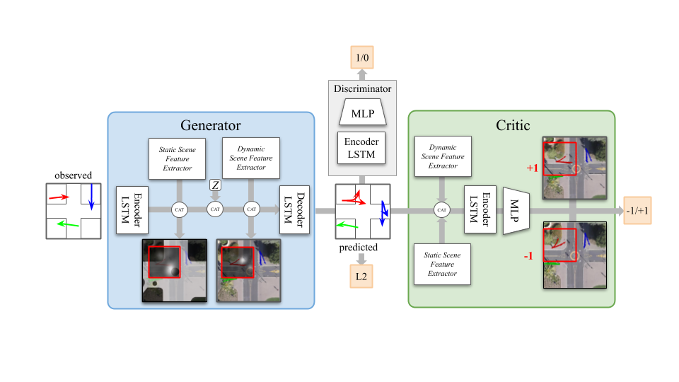

# FLORA

FLORA: Future prediction of obstacle locations in traffic scenes for collision avoidances.

## Environment
Datasets are the SDD and UCY dataset, containing various trajectories of pedestrians and cyclists. The goal of the model is to minimise the average displacement errors, number of collisions between agents and violations between agents and obstacles. 

## Results
Check the results of the three networks:
- Without context (Null)
- With dynamic and static context pooling (ContextPooling)
- With context and the critic and discriminator evaluators (ContextPoolingEvaluator)

Baseline models:

| Model | SocialGAN  | SoPhie  |
| :-----: | :-: | :-: |
| ADE |  0.61 | 0.54 |
| FDE |   1.21 | 1.15 |

## Model 
SafeGAN synergizes generative adversarial networks (GAN) for generating multiple “real” trajectories with a reward network to generate plausible trajectories penalizing collisions. The reward network, Oracle, is environmentally aware to prune trajectories which result in collision.

Our benchmark is against DESIRE, SocialGAN and SoPhie. These generating models have similar structure (a generating module which takes in the observed trajectories and additional into scene information) and may differ in evaluation module (DESIRE has a seperate module, while R2P2 has an additional loss term). 

## Train and evaluate model
```bash
python3 -m scripts.train               # Trains the model
python3 -m scripts.evaluate_model      # Evaluates a trained model
```

## Folder structure
The folders are organized as follows:
- [scripts/evaluation](scripts/evaluation) contains evaluation scripts for evaluating on test and train data.
- [scripts /training](scripts/training) contains the training algorithms for the network on either UCY or SDD dataset.
- [sgan/model](sgan/model) contains the generator network. 
- [sgan/evaluation](sgan/evaluation) contains the critic and discriminator networks. 
- [sgan/context](sgan/context) contains the pooling networks. 
- [sgan/data](sgan/data) contains the data loaders. 

## Dependancies
The code is written in Python and Pytorch with the following dependancies [requirements.txt](requirements.txt)


## Improvements
### Evaluator
- [ ] Critic: Pooling or alternative Value (or Q-value, Advantage function) approximation ([numPeds x numPeds x time]).

### Generator
- [X] Timing: pool every with static and dynamic takes 8min.
- [ ] Loss from critic: Discount rewards, normalize, future.

### Pooling
- [X] Input segmented boundary points.
- [X] Visualize physical pooling attention. 
- [X] Init hidden and grad?

### Baselines
- [ ] Compute new minADE, minFDE, meanSampleMSE, DC, OC, test & train. 
- [ ] Test on SDD, UCY, ALL.
- [X] DESIRE
- [ ] SoPhie
- [ ] REINFORCE

### Code quality
- [ ] Organize code: Seperate dataset from model, delete simple lstm, seperate code in scripts, sgan into more folders (better naming)

### Cluster computing
- [ ] Make kubernetis work
 
